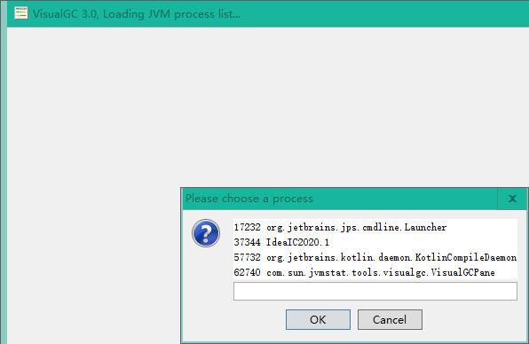

# visualgc_jdk8
The VisualGC 3.0 standalone version with enhancement for HotSpot JDK 8.

VisualGC 3.0 独立运行版, 支持JDK 8, 增强了部分功能.

1. Support choose JVM process upon start;
2. Added support for detailed collectors GC time;
3. Display detailed values(time:value) on chart mouse hover;
4. Run under Hotspot JDK  8+, supports monitor Hotspot JDK 1.5 ~ 14, tested for CMS, G1;
5. Supports Chinese and English language.

This tool is distributed in the hope that it will be useful, but WITHOUT
 ANY WARRANTY; without even the implied warranty of MERCHANTABILITY or FITNESS FOR A PARTICULAR PURPOSE.

------

1. 支持启动时选择 JVM 进程列表;
2. 支持观测详细的收集器GC暂停时间;
3. 图表支持鼠标移动详细信息显示(时间和值);
4. 支持 Hotspot JDK  8+版本下运行, 可检测 Hotspot JDK 1.5 ~ 14, 在 CMS, G1等收集器下检测通过;
5. 中英双语显示.

此工具仅希望能有所帮助, 但不提供任何担保.

